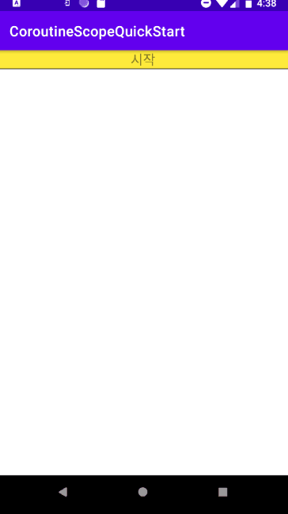

### ViewModel안에서 CoroutineScope를 이용한 HTTP 통신
> 간편하고 안정적으로 ViewModel안에서 coroutine 사용하기

[코틀린 coroutine 참고](https://github.com/VintageAppMaker/KotlinOnepointLesson/tree/master/src/main/kotlin/asynclib)

kotlin을 사용한다면 AsyncTask보다 안정적이고 편리한 coroutine을 사용하는 것이 현명한 선택이다.
- flow는 coroutine내에서 스트림과 같은 순차적 프로그래밍을 할 때 사용한다. 주로 네트웍 통신에서 유용하게 사용된다.
- flow{}내에서 emit으로 값을 전달하면 collect에서 받아 처리한다.
- 동영상 플레이하면서 썸네일 리스트를 보여줄 때
- 한 화면에 다수의 서버통신을 해야 할 때
사용하면 효과적으로 이용할 수 있다. ViewModel을 사용한다면 화면이 회전할 떄나 화면이 종료되어도 안정적으로 메모리 누수없이 통신을 종료할 수 있다.

gradle(app)
~~~
implementation ("org.jetbrains.kotlinx:kotlinx-coroutines-core:1.4.2")
implementation ("org.jsoup:jsoup:1.13.1")
~~~

MainViewModel.kt
~~~kotlin
package com.example.coroutinescopequickstart.ui.main

import android.util.Log
import androidx.lifecycle.MutableLiveData
import androidx.lifecycle.ViewModel
import kotlinx.coroutines.*
import kotlinx.coroutines.flow.*
import org.jsoup.Jsoup

class MainViewModel : ViewModel() {
    var imgList     = MutableLiveData<MutableList<String>>()
    private val lst = mutableListOf<String>()

    var status      = MutableLiveData<String>()
    var nProgress   = 0

    // Flow처리 완료시 UI에 리스트 값을 전송
    var onComplete :() -> Unit  = {
        imgList.postValue(lst)
    }

    init {
        status.postValue("시작")
        getImageInfoFromNetwork("http://vintageappmaker.com", onComplete)
    }

    fun getImageInfoFromNetwork(url : String, onComplete : () -> Unit) {

        // 통신처리를 안전하게 CoroutineScope를 사용함
        // ViewModel이 메모리 삭제시
        // 모든작업 취소 및 종료
        CoroutineScope(Dispatchers.IO).launch {

            // flow는 통신처리를
            // 순차적으로 하기위함
            // 진행상황을 UI에 리포팅
            flow{
                var doc = Jsoup.connect(url).get()
                var lst = doc.getElementsByTag("img")
                lst.forEach {
                    var sUrl = it.attr("src")
                    emit(sUrl) // collect로 보냄
                    delay(400)
                }

                // 모두 처리했음
                emit(true)
            }.collect {

                // 임의적으로 bool 값이면 종료라고 판단
                if (it is String ) {
                    Log.d(this.javaClass.toString(), "[network] image complete => $it")
                    lst.add(it)

                    // UI 쓰레드로 진행정보 전송
                    status.postValue("추가 - ${nProgress++} ")

                } else {
                    // 종료 callback 호출
                    status.postValue("종료")
                    onComplete()
                }
            }
        }
    }
}
~~~

MainFragment.kt
~~~kotlin
package com.example.coroutinescopequickstart.ui.main

import androidx.lifecycle.ViewModelProvider
import android.os.Bundle
import androidx.fragment.app.Fragment
import android.view.LayoutInflater
import android.view.View
import android.view.ViewGroup
import android.widget.LinearLayout
import android.widget.TextView
import android.widget.Toast
import androidx.lifecycle.Observer
import com.example.coroutinescopequickstart.R

class MainFragment : Fragment() {

    companion object {
        fun newInstance() = MainFragment()
    }

    private lateinit var viewModel: MainViewModel

    override fun onCreateView(inflater: LayoutInflater, container: ViewGroup?,
                              savedInstanceState: Bundle?): View {

        viewModel = ViewModelProvider(this).get(MainViewModel::class.java)

        val v = inflater.inflate(R.layout.main_fragment, container, false)
        bindingObserver(v.findViewById(R.id.message), v.findViewById<LinearLayout>(R.id.lnMessage))
        return v
    }

    private fun bindingObserver(txt : TextView, ln :LinearLayout) {

        viewModel.imgList.observe(this, Observer {
            lst ->
            if (lst.size < 0) return@Observer

            lst.forEach { item ->
                ln.addView(TextView(activity!!.baseContext).apply { text = item })
            }
        })

        viewModel.status.observe(this, Observer {
            txt!!.text = it
        })
    }

}
~~~
